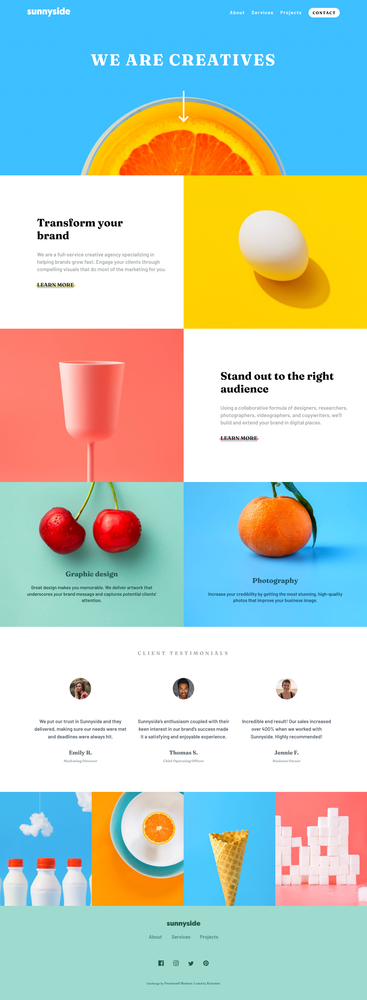

# Frontend Mentor - Sunnyside agency landing page solution

This is a solution to the [Sunnyside agency landing page challenge on Frontend Mentor](https://www.frontendmentor.io/challenges/sunnyside-agency-landing-page-7yVs3B6ef). Frontend Mentor challenges help you improve your coding skills by building realistic projects.

## Table of contents

- [Overview](#overview)
  - [The challenge](#the-challenge)
  - [Screenshot](#screenshot)
  - [Links](#links)
- [My process](#my-process)
  - [Built with](#built-with)
  - [What I learned](#what-i-learned)
  - [Continued development](#continued-development)
  - [Useful resources](#useful-resources)
- [Author](#author)
- [Acknowledgments](#acknowledgments)

## Overview

### The challenge

Users should be able to:

- View the optimal layout for the site depending on their device's screen size
- See hover states for all interactive elements on the page

### Screenshot

### Links

- Solution URL: [Add solution URL here](https://github.com/talentlessDeveloper/sunnyside-agency-landing-page/)
- Live Site URL: [Add live site URL here](https://talentlessdeveloper.github.io/sunnyside-agency-landing-page/)

## My process

### Built with

- Semantic HTML5 markup
- CSS custom properties
- Flexbox
- CSS Grid

### What I learned

Patience 😄 :smile: , working with background-images to fit mobile,ipad and desktop was hard.

### Continued development

Doing more projects that would make me put into more practice background-images, grid and flexbox.

Also can't seem to choose a either a mobile or desktop first approach.

### Useful resources

- Stackoverflow.
- W3schools.

## Author

- Website - [Add your name here](https://www.your-site.com)
- Frontend Mentor - [@talentlessDeveloper](https://www.frontendmentor.io/profile/talentlessDeveloper)
- Twitter - [@yourusername](https://www.twitter.com/kcreeem)

## Acknowledgments

My use of scss stems from watching Jessica Chan's youtube videos. Now i'm a little bit comfortable using them thanks to her amazing videos.
